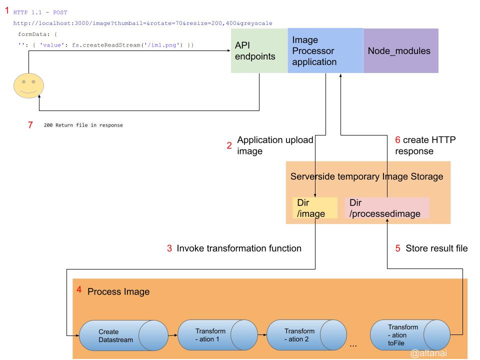
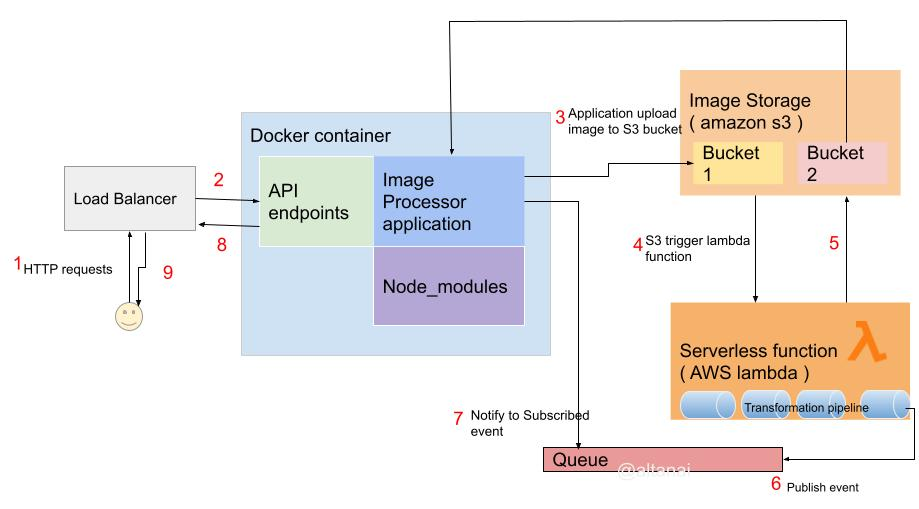

# Image processor API for node

Stateless image processing Service 


## Overview 
Receive an image in one of the acceptable image formats. 
Perform any of the combinations of the operations: flip horizontal and vertical , rotate +/- in degrees , Convert to grayscale, resize , generate a thumbnail , rotate left and right, as specified in the request accounting the image post request.
Return the processed image and delete any server side copies of original and processed image .

**Performs operations**
- Flip horizontal and vertical
- Rotate +/- n degrees 
- Convert to grayscale 
- Resize
- Generate a thumbnail
- Rotate left
- Rotate right


## API usage 

http://localhost:3000/image?resize=400,300&greyscale=1&rotate=60

http://localhost:3000/image?thumbail=&rotate=70&resize=200,400&greyscale

### Swagger 

API docs - http://localhost:3000/api-docs 


### CURL

```shell
curl -X POST -F  "image=@/pathtoimagefifle" --output -i "localhost:3000/image?resize=400,300&greyscale=1&rotate=60"
```

Example 
```shell
curl -X POST -F  "image=@/home/altanai/Desktop/Altanai-Bisht1.jpg" --output  -i "localhost:3000/image?resize=400,300&greyscale=1&rotate=60"  
  % Total    % Received % Xferd  Average Speed   Time    Time     Time  Current
                                 Dload  Upload   Total   Spent    Left  Speed
100  147k  100 30661  100  117k  1575k  6163k --:--:-- --:--:-- --:--:-- 7352k
```

## Solution Design 

The solution is built as a nodejs project using 

1. Installation of libvipis image processing library on server and interface using npm module sharp.

2. Web server using HTTP 1.1 protocol to expose web service API primarily on HTTP methods POST

3. npm modules to support various operations such as 
- building HTTP servers for APIs, 
- processing files as nodejs streams ,
- auto generating API documentation using annotations , 
- linter for code quality analysis and so on. 

4. Npm packaging and  scripts to install and start processes  

5. Docker to containerize the service 


## Flow 

The solution builds an operation sequence with image processing transformations  serialized in a single post request query string. It also accepts a file as a multipart request.
The image is read into a data stream and passed for processing according to pipelined operations.
The operations are individually defined in a library which invokes a core library sharp and builds a pipeline according to matchinging switch case .
At the end of the pipeline , the writable stream is written to a file and returned as output.



## Dockerizing and Cloud Deployment



Make image
```shell
docker build -t altanai/imageprocessor-sharp-api .
```

Run Image 
```shell
docker run -p 3000:3000 -d altanai/imageprocessor-sharp-api
```

Other operations on docker 
```shell
# Get container ID
$ docker ps

# Print app output
$ docker logs <container id>

# Enter the container
$ docker exec -it <container id> /bin/bash
```

## References 

- sharp https://sharp.pixelplumbing.com/
- Nodejs Streams 
- Swagger https://swagger.io/docs/
- Docker
